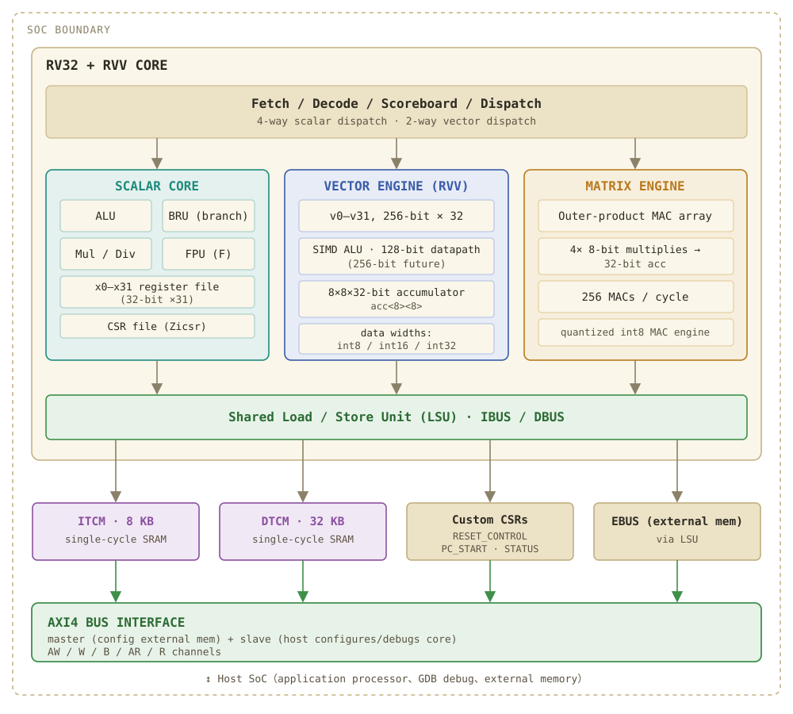

# Magpie_M3V — a self-built RV32 NPU targeting functional parity with Google Coral

**Magpie_M3V** is a synthesizable two-core RISC-V SoC: a host CPU (`cpu_m1`) driving, over AXI, a
self-built **NPU domain** whose goal is to *functionally replace* the Google Coral (Kelvin) NPU —
run the same open-source int8 TFLM inference path (RVV Zve32x + a 256-MAC matrix engine) with
bit-exact results, verified against the Spike ISS by per-commit lockstep.

> This line is **clean-room / self-built** (not an import). Correctness authority is the project's
> own **Spike lockstep + bit-accurate golden + scoreboards** — not "looks right" or a passing lint.

## Architecture

*Top-level block architecture (partitioned by Coral-NPU component). Below: the 4-stage pipeline and the memory hierarchy.*

### How the three engines divide the work

The NPU runs one inference across **three engines**, and the split is decided by a single
mechanical criterion — *does the op accumulate along a **contraction axis** (a dimension that is
summed away and vanishes from the output)?* The compiler backend (MLIR `linalg` parallel-vs-reduction
dims) assigns each op at lowering time; the developer never hand-partitions.

| Engine | Role | Work | ISA / interface |
|---|---|---|---|
| **Scalar** (control) | only touches **addresses** | loops · addr-gen · branches · issue commands · sync | standard **RV32IM(F)** |
| **Vector** (element-wise) | touches **data**, no axis vanishes | activation · bias · requantize · pooling (relu/add/rescale/pool) | standard **RVV Zve32x** |
| **Matrix** (accumulate along axis) | a **contraction axis** is summed away | matmul · conv · QKᵀ | custom **command** (not ISA) |

`C[i,j] = Σₖ A[i,k]·B[k,j]` — the `k` dimension exists in the inputs but disappears in `C`; that is
the contraction axis, and "accumulate along it" is exactly MAC (multiply-accumulate, accumulator
never cleared) → it needs the **matrix engine's accumulator array**. Element-wise ops (e.g. ReLU:
input shape = output shape, nothing vanishes) need no accumulator → the **vector engine**. This
"does it converge onto one accumulator?" test is what draws the scalar/vector/matrix boundary.
Full walk-through (instruction-vs-command identity, fence/memory hand-off between engines, and a
worked CNN example): [`docs/rv-npu_operation.html`](docs/rv-npu_operation.html).

## What's inside

| Area | Highlights |
|---|---|
| **Scalar core** | RV32IM**F** parametric spine (`EN_RVC/EN_BP/EN_RAS/EN_F/EN_RVV`); 4-stage in-order; host = full, NPU = stripped run-to-completion sequencer |
| **Vector** | Standard **RVV Zve32x**, integer + LMUL (mf8..m8) full grid; vector-CSR lockstep contract |
| **Matrix** | 256-MAC (LANES 1/2/4) outer-product int8→int32 + gemmlowp requant; NumPy golden |
| **NPU domain** | AXI4-Lite CSR / TCM (Harvard ITCM+DTCM, real TSMC28 SRAM macro) / bidirectional DMA / shared-mem command-queue |
| **ML e2e** | TFLM FC / MLP / CNN + MobileNet block + **Gemma-3 270M decoder layer**, all int8 bit-exact vs TFLM |
| **SoC** | `soc_m3v_top` two-core (host --AXI--> NPU), PLIC/IRQ, DMA width scaling with LANES |

## Verification

Open-source, one-command reproducible: **Verilator (DUT) + Spike (golden) + riscv64-unknown-elf-gcc
(firmware)**. Functional gates live in `gates/`, `sim/gates/`, `dv/gates/`; the RTL↔ISS lockstep
harnesses are under `flow/v2_pipeline/phase_2*`. See **[`EXTERNAL_DEPS.md`](EXTERNAL_DEPS.md)** for
exactly what a fresh checkout needs (Verilator / Spike / RISC-V GCC on `PATH`).

## Physical (TSMC28, Synopsys DC + real dual-port TCM SRAM macros)

The full flagship `npu_top` (MAT_LANES=4 / DMA_DATA_W=256, RV32IMF + full Zve32x + 256-MAC) is
DC-synthesizable and timing-closed. A multi-cycle rework of the divide/sqrt/FMA datapaths took it
from **166.7 MHz → ~460 MHz (2.8×)** while cutting cell area **−50%**, moving the critical path out
of the CPU core onto the matrix-engine MAC. Details:
[`docs/reports/2026-07-09_fdiv_multicycle_poc.md`](docs/reports/2026-07-09_fdiv_multicycle_poc.md).

## Where to start

- **[`CLAUDE.md`](CLAUDE.md)** — architecture, memory map, phase status, and the per-phase design
  discipline (the primary orientation doc).
- **`docs/adr/`** — architecture decision records · **`docs/reviews/`** — design reviews ·
  **`docs/reports/`** — PPA / perf reports.
- **`design/`** — core + NPU RTL · **`design/*/docs/`** — per-phase design confirmations.

## License / provenance

Self-built RTL. The RISC-V specification is the architectural contract; Google Coral
(Apache-2.0) is *observed* for parity, not copied. Licensed EDA tools (VCS, Spyglass, Design
Compiler, Vivado) and the TSMC28 PDK are **not** included — the open-source core flow runs without
them (see `EXTERNAL_DEPS.md`).
