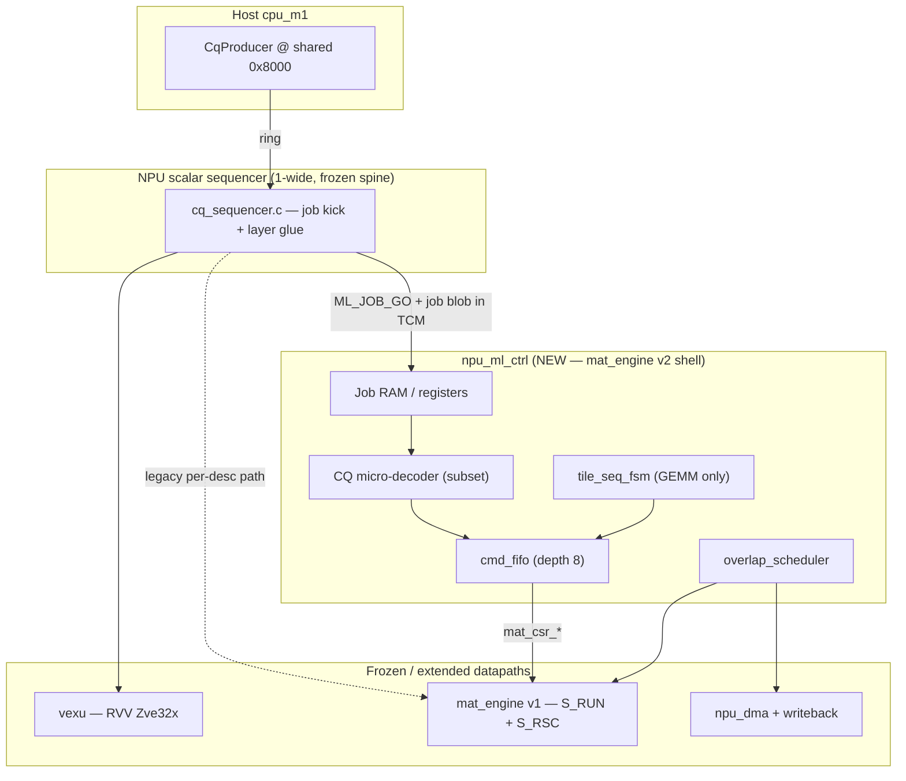

# mat_engine v2 — ML Execution Domain Architecture (PROPOSED)

- **Status:** PROPOSED — for Claude/Codex evaluation & phased RTL implementation
- **Date:** 2026-07-07
- **Author:** Grok (architecture draft from M3V perf analysis session)
- **Relates:**
  - ADR-0037/0040/0042 (`mat_engine.v` v1 MAC + requant, **frozen datapath**)
  - ADR-0035/0052 (CQ SSOT + batched descriptor prefetch, firmware-only)
  - ADR-0053 (requant 2-stage pipe, DC critical path)
  - ADR-0066 (`MAT_REQUANT_VEC` / `CMD_LOADVEC`, proposed additive)
  - ADR-0062 (Gemma-3 decoder layer bit-exact + `profile_gemma_layer.py` baseline)
- **Authority:** Existing `mat_golden.py` + Gemma S0–S5 gates + `gate_45..52` unchanged semantics
- **Non-goals:** Coral 4-wide, hardware VCQ clone, monolithic Norm+Softmax inside MAC array

---

## §0 Executive summary

**mat_engine v2 is NOT a replacement MAC array.** It is a thin **ML execution shell**
(`npu_ml_ctrl`) wrapped around the proven v1 `mat_engine` datapath, plus standardized
command issuance for all CQ-driven ML ops.

| What changes | What stays frozen |
|---|---|
| Tile/job sequencer FSM, command FIFO, DMA↔engine overlap | `S_RUN` 256-MAC outer-product math |
| Unified kick/poll (`ML_JOB_GO` / `ML_JOB_STATUS`) | `S_RSC` gemmlowp requant bit-quirks |
| Descriptor expansion in hardware (GEMM tile loops) | `mat_golden.py` golden semantics |
| ADR-0066 `CMD_LOADVEC` additive cmd | Spike lockstep / RVV ISA |

**Design bet:** Gemma layer profile shows **89% wall on scalar orchestration**, not MAC
throughput. v2 attacks **per-tile / per-descriptor spin-poll**, not MAC width.

Measured baseline (post RVV Cycle-1 residual, `profile_gemma_layer.py`):
- Layer total: **349,824 cyc**
- GEMM steps wall: **116,553 cyc** (mat busy **5,658**, core* spin **~76k**)
- Nonlinear: **~259k** (addressed by RVV + ADR-0066, not by MAC array)

**Target (v2 Phase A+B on Gemma layer):** layer **~220k–260k cyc** (projected, must re-measure).

---

## §1 Problem statement

### 1.1 v1 architecture (today)

```
Sequencer firmware (1-wide scalar)
  → per CQ descriptor: DMA fetch 16B from ring @0x8000
  → decode → CSR write mat_engine / dma / wb
  → poll mat_busy / dma_busy (synchronous)
  → HEAD++
```

ADR-0052 batched descriptor **fetch** (N=8) but **dispatch is still per-descriptor**
with per-op CSR + poll. For `gate_proj` (16 tiles × ~6 ops): **~96 firmware round-trips**,
**~187 cyc/op fixed tax** → **~18k cyc** is spin/orchestration, not compute.

### 1.2 Why not fold Norm/Softmax/activation into mat_engine MAC?

| Op class | Compute shape | v1 MAC array fit |
|---|---|---|
| GEMM / proj / QKᵀ / AV | Outer-product 8×8 tiles | ✅ purpose-built |
| RMSNorm / QK-norm | Reduce + polynomial | ❌ not outer-product |
| Softmax | LUT + sum + divide | ❌ sequential |
| GeGLU / gelu | LUT lookup | ❌ not MAC |
| ewise_mul | Elementwise | ❌ diagonal mapping ≤12.5% util |

**Rule (ADR-0066 seam):** ≤32-bit SIMD → **RVV**; gemmlowp 64-bit requant → **mat_engine
S_RSC**; GEMM MAC → **mat_engine S_RUN**. v2 adds **control** only, not a monolith.

---

## §2 Design principles

1. **Datapath frozen, control evolvable** — `mat_engine.v` S_RUN/S_RSC semantics are
   authoritative; v2 modules sit in front of CSR ports.
2. **Engine-command-stream equivalence** — Any v2 path must produce the **same** sequence
   of mat_engine CSR transactions as today's CQ firmware (ADR-0052 E1 framing).
3. **Phased gates** — Each phase independently gated; no "big bang" RTL drop.
4. **Backward compatible** — Direct CSR / legacy CQ firmware path remains (debug + gates).
5. **Honest dims** — Gemma representative dims (hidden=64) for mechanism; no production
   270M latency claims without re-profile.
6. **SKU parameterization** — `LANES=4` (256 MAC), `FIFO_DEPTH`, `JOB_RAM_DEPTH` are
   parameters; core math unchanged.

---

## §3 Architecture overview



### 3.1 Module list (new RTL)

| Module | File (proposed) | Role |
|---|---|---|
| `npu_ml_ctrl` | `design/npu/rtl/npu_ml_ctrl.v` | Top shell: job kick, status, err, arb vs legacy CSR |
| `ml_cmd_fifo` | `design/npu/rtl/ml_cmd_fifo.v` | Queue of **engine micro-ops** (not raw CQ ring entries) |
| `ml_tile_seq` | `design/npu/rtl/ml_tile_seq.v` | Expand GEMM job → tile OP/RESCALE chain |
| `ml_overlap` | `design/npu/rtl/ml_overlap.v` | Double-buffer weight DMA while mat busy |
| `ml_job_regs` | inside `npu_ml_ctrl` | Job descriptor register file |

**Integration point:** `npu_top.v` — instantiate `npu_ml_ctrl` between `csr` mat_* ports
and `u_mat`, with bypass mux for legacy firmware CSR path (gates 45–52).

---

## §4 Interfaces

### 4.1 Job kick (firmware → hardware)

Firmware writes a **Job Descriptor Blob** to TCM (fixed layout, SSOT in YAML), then
pulses `ML_JOB_GO` via core-local CSR window `0x0002_xxxx`.

```c
// design/npu/sw/include/ml_job.h (to be generated from schema)
typedef struct {
    uint32_t job_type;      // ML_JOB_GEMM = 1, ML_JOB_REQUANT_VEC = 2, ...
    uint32_t flags;         // [0]=irq_on_done [1]=last_in_layer
    uint32_t tile_m;        // output rows (logical)
    uint32_t tile_n;        // output cols
    uint32_t tile_k;        // K bytes (ADR-0039 CFG.K)
    uint32_t a_base;        // TCM byte addr, 32B aligned
    uint32_t b_base;
    uint32_t out_base;
    uint32_t bank;          // acc bank 0..3
    uint32_t rpt_total;     // total outer products (unchanged ADR-0040 semantics)
    uint32_t mult, rsp, clamp; // requant params (per-tensor or PC blob ptr)
    uint32_t w_dma_src;     // shared mem weight region (LOAD_W overlap)
    uint32_t w_dma_len;     // bytes
} ml_gemm_job_t;            // 64 bytes, cache-friendly
```

**CSR additions** (core-local mirror, addr TBD in `cq_defs.vh`):

| CSR | Access | Description |
|---|---|---|
| `ML_JOB_ADDR` | RW | TCM pointer to job blob |
| `ML_JOB_GO` | WO pulse | Accept job if `!ml_busy` |
| `ML_JOB_STATUS` | RO | `{busy, done, err, err_code[7:0]}` |
| `ML_JOB_CFG` | RW | `[0]` legacy_bypass (force v1 firmware path) |

### 4.2 Command FIFO entry (hardware internal)

Each FIFO slot = one **mat_engine invocation** (maps 1:1 to today's CSR sequence):

```verilog
typedef struct packed {
    logic [2:0]  cmd;       // CMD_OP / RESCALE / LOADACC / LOADVEC / CLR
    logic [3:0]  bank;
    logic [7:0]  rpt;
    logic [31:0] a_addr;
    logic [31:0] b_addr;
    logic [31:0] mult;
    logic [31:0] rsp;
    logic [31:0] clamp;
    logic [31:0] out_base;
} ml_engine_op_t;           // fed to mat_engine ports when fifo pop + !mat_busy
```

### 4.3 Legacy compatibility mux

```verilog
// npu_top.v (conceptual)
wire legacy_path = ml_job_cfg_legacy_bypass || !ML_V2_EN;
assign mat_go   = legacy_path ? fw_mat_go   : ml_mat_go;
assign mat_cmd  = legacy_path ? fw_mat_cmd  : ml_mat_cmd;
// ... all mat_* signals
```

All existing gates run with `ML_V2_EN=0` or `legacy_bypass=1` → **zero regression default**.

---

## §5 Functional blocks

### 5.1 `ml_tile_seq` — autonomous GEMM tiling (Phase A, highest ROI)

**Input:** `ml_gemm_job_t`  
**Output:** Expanded sequence pushed to `ml_cmd_fifo`:

```
for each output tile (m_t, n_t):
    [optional] CMD_LOADACC / ACC_CLR  (from job flags)
    CMD_OP  rpt=tile_rpt  a_ptr+=  b_ptr+=   (fused 4-k steps per ADR-0040)
    CMD_RESCALE  out_base+=
```

**Hardware responsibilities:**
- Compute `a_ptr`/`b_ptr` strides (+32B per fused step on K axis)
- Handle `rpt % 4` tail via existing `lane_en` (no RTL change in `mat_engine`)
- Track tile grid: `ceil(M/8) × ceil(N/8)` iterations
- **No firmware poll between tiles**

**Overlap (via `ml_overlap`):**
- While `mat_busy`, issue next tile's `LOAD_W` via DMA if `w_dma_*` valid
- Requires **distinct acc banks** or serialized RESCALE before next OP on same bank
  (same rule as today firmware; document in job validator)

**Measured attack surface:** ~76k GEMM core* spin + portion of 35k DMA wait.

### 5.2 `ml_cmd_fifo` — engine command queue (Phase A)

| Parameter | Default | Note |
|---|---|---|
| `FIFO_DEPTH` | 8 | Matches ADR-0052 batch sweet spot |
| Issue policy | Block on `mat_busy` | Same as today GO-while-busy ignored |
| Error | Sticky `err_param` → job abort | Propagate to `ML_JOB_STATUS` |

Decouples **issue rate** from firmware retire rate. Firmware kicks one GEMM job;
FIFO drains 16+ tiles without scalar involvement.

**Explicit non-goal in Phase A:** Non-blocking issue while engine busy on **same bank**
(same-bank accumulate hazard — keep illegal / stall).

### 5.3 `ml_cq_bridge` — selective CQ opcode hardware dispatch (Phase B)

Not all CQ ops become jobs. Phase B maps **high-volume** opcodes to fast paths:

| CQ opcode | v2 path | Datapath |
|---|---|---|
| `MAT_OP` | `ML_JOB_GEMM` (tiled) | mat_engine S_RUN |
| `MAT_RESCALE` | folded in GEMM job | mat_engine S_RSC |
| `MAT_LOAD_W` | `ml_overlap` | DMA |
| `MAT_STORE` | job completion / separate `ML_JOB_STORE` | writeback DMA |
| `MAT_REQUANT_VEC` | `ML_JOB_REQUANT_VEC` (ADR-0066) | LOADVEC + RESCALE |
| `MAT_RMSNORM` | **firmware + RVV** (Phase C) | not MAC |
| `MAT_SOFTMAX` | firmware + LUT handler | not MAC |
| `MAT_ACT_LUT` / `MAT_EWISE_MUL` | RVV front + optional requant job | seam |
| `MAT_ROPE` | RVV front + requant job | seam |
| `MAT_FENCE` / `MAT_ACC_CLR` | FIFO flush barrier | control |

### 5.4 RVV + mat_engine collaboration (unchanged philosophy)

```
         ┌─────────────────────────────────────┐
         │  RVV (≤32-bit SIMD)                │
         │  vadd, vmul, vred, vmax, vrgather…  │
         └──────────────┬──────────────────────┘
                        │ int32 vector in TCM
                        ▼
         ┌─────────────────────────────────────┐
         │  mat_engine S_RSC (64-bit srdhm)    │
         │  via LOADVEC + RESCALE job          │
         └─────────────────────────────────────┘
```

**Do not** route RMSNorm reduce through MAC array. Phase C optimizes RMSNorm in RVV
firmware (rewrite golden) — separate ADR, not v2 MAC scope.

---

## §6 Phased implementation plan

### Phase 0 — Architecture sign-off (this document)

- [ ] User / Claude PL accept §2 principles + §5 scope cuts
- [ ] Grok review (no tools) + Gemini consistency pass
- [ ] Assign ADR number (proposed **ADR-0067**)

### Phase A — GEMM tile sequencer only (RTL)

**Deliverables:**
- `npu_ml_ctrl.v` + `ml_tile_seq.v` + `ml_cmd_fifo.v` (minimal)
- CSR `ML_JOB_*` in `cq_defs.vh` + `ml_job.h` SSOT generator
- Firmware: `cq_emit_gemm_job()` for one proj (e.g. `k_proj`) as PoC
- `legacy_bypass` default **1**

**Exit gates:**
| Gate | Criterion |
|---|---|
| `gate_67_ml_v2_equiv` (new) | ML_JOB path vs direct-CSR: **identical** mat_engine CSR transaction stream per ADR-0052 E1 |
| `gate_45` regression | 0 failures, legacy path |
| `gate_gemma3_layer_rtl` | Bit-exact unchanged (legacy path) |
| `profile_gemma_layer.py` | One GEMM step (e.g. `gate_proj`) ≥**2×** speedup vs 26,598 cyc |

**Estimated RTL:** ~400–600 lines (control only), 0 changes to `mat_engine` S_RUN/S_RSC.

### Phase B — DMA overlap + ADR-0066 integration

**Deliverables:**
- `ml_overlap.v` weight double-buffer
- `CMD_LOADVEC` in `mat_engine.v` (ADR-0066 §2.1, ~20 lines)
- `ML_JOB_REQUANT_VEC` job type
- Firmware: `ewise_mul` / `RoPE` → RVV front + requant job

**Exit gates:**
| Gate | Criterion |
|---|---|
| `gate_66_requant_vec` | LOADVEC+RESCALE bit-exact vs `mat_golden.requant` |
| `gate_gemma3_s0` / `s2` | Byte-identical |
| Profile | `ewise_mul` ≥**2×** (honest: needs Phase A + B together for 4×) |

### Phase C — Layer program fusion (firmware + optional HW)

**Deliverables:**
- Single in-NPU TCM **layer micro-program** (22 steps → 1 kick)
- Intermediates resident in DTCM (drop reload DMA)
- RMSNorm RVV-native golden (new ADR)

**Exit gates:**
- Full layer profile ≥**2×** vs 349,824 cyc
- S0–S5 bit-exact

### Phase D — (Optional, defer) Multi-job queue

- Only if Phase A–C still show engine-starved (unlikely per profile: engine idle 98.5%)

---

## §7 Verification plan

### 7.1 Equivalence framing (mandatory, from ADR-0052)

| Level | Definition | Authority |
|---|---|---|
| **E1** | mat_engine CSR stream identical | `mat_golden.py`, gate_46 |
| **E2** | HEAD/IRQ/FENCE/ERR semantics unchanged | gate_35–39 |
| **E3** | Descriptor-fetch DMA may differ | log only, non-fail |

### 7.2 New directed tests

```
design/npu/dv/tb/tb_ml_v2_equiv.v     — ML_JOB vs CSR bit-compare on mat ports
design/npu/dv/tb/tb_ml_tile_seq.v     — tile pointer math, rpt tail, bank rules
sim/gates/gate_67_ml_v2_equiv.py      — orchestrator gate
```

### 7.3 Green-wash guards

- Do **not** claim layer speedup without `profile_gemma_layer.py` re-run
- Do **not** change `mat_golden.py` to mask divergence
- Do **not** disable legacy path in CI (both paths must stay green in Phase A–B)
- Throughput claims separate from bit-exact claims

---

## §8 Coral / replaceability comparison

| Aspect | Coral/Kelvin | M3V v1 | M3V v2 (this doc) |
|---|---|---|---|
| Command issue | HW VCQ + 4-wide | Firmware per descriptor | **HW tile seq + cmd FIFO** |
| MAC array | In-core mac_unit | `mat_engine` 256 MAC | **Same** (frozen) |
| Activation/norm | Custom ML ISA | CQ + RVV | **Same datapaths, better issue** |
| Replaceability | — | Function parity path | **Improves offload overhead, not ISA** |

**Honest deviation:** v2 is **control-plane parity** with Coral's low-overhead streaming,
not a Coral backend port.

---

## §9 Resource & timing estimates

| Item | Estimate | Note |
|---|---|---|
| Area | +3–5k gates (FSM + FIFO + job regs) | vs ~256 MAC array already dominant |
| Critical path | Unaffected | ADR-0053: requant still limits `mat_engine` |
| DTCM | Job blob ≤128B + FIFO shadow | Fits 32KB budget |
| ITCM | +~2KB firmware for job emit | Monitor gate_52 memsize |

---

## §10 Explicit rejections (scope cut)

| Rejected | Reason |
|---|---|
| Monolithic mat_engine v2 MAC with Norm/Softmax inside | ≤12.5% util, golden hell |
| Widen acc to 64-bit | ADR-0066: multiply already 64-bit; acc stay int32 |
| 512-MAC / second engine | Profile: S_RUN = 0.29% wall |
| Replace CQ SSOT | v2 consumes CQ semantics, does not redefine opcodes |
| Hardware VCQ for RVV | ADR-0049 scope cut |
| Drop legacy CSR path | Breaks gates + debug |

---

## §11 Open questions for Claude code review

1. **Job blob in TCM vs CSR-only job regs** — TCM blob scales to per-channel params;
   pure CSR limited to ~12 registers. **Proposal:** TCM blob SSOT, CSR holds pointer only.
2. **Bank allocation policy** — Auto-assign banks across fused QKV jobs to enable overlap?
   Or firmware-specified (safer Phase A)?
3. **`ML_V2_EN` parameter** — Global `npu_top` param default 0 until gate_67 green?
4. **STORE completion** — Tile seq ends at RESCALE in TCM; STORE remains separate DMA job
   or folded into `ML_JOB_GEMM` with `flags.store_en`?
5. **Abort / hard_reset interaction** — FIFO drain rules under ADR-0038/0047 (proposed:
   sticky abort clears FIFO, mat_engine `abort_i` unchanged).
6. **ADR-0066 merge** — Implement `CMD_LOADVEC` before or with Phase A? **Proposal:**
   Phase B (depends on cmd_fifo existing).

---

## §12 Suggested file touch list (for Codex)

| Action | Path |
|---|---|
| ADD | `design/npu/rtl/npu_ml_ctrl.v` |
| ADD | `design/npu/rtl/ml_cmd_fifo.v` |
| ADD | `design/npu/rtl/ml_tile_seq.v` |
| ADD | `design/npu/rtl/ml_overlap.v` (Phase B) |
| MODIFY | `design/npu/rtl/npu_top.v` — instantiate + mux |
| MODIFY | `design/npu/rtl/cq_defs.vh` — ML_JOB CSR addrs |
| ADD | `design/npu/schema/ml_job.yaml` — SSOT |
| MODIFY | `design/npu/sw/cq_sequencer/cq_sequencer.c` — job emit PoC |
| ADD | `sim/gates/gate_67_ml_v2_equiv.py` |
| ADD | `design/npu/dv/tb/tb_ml_v2_equiv.v` |
| NO CHANGE (Phase A) | `design/npu/rtl/mat_engine.v` S_RUN/S_RSC |

---

## §13 Success metrics (Gemma-3 decoder layer)

| Metric | Baseline | Phase A target | Phase A+B+C target |
|---|---:|---:|---:|
| Layer wall-clock | 349,824 | ≤320k | ≤220k |
| `gate_proj` step | 26,598 | ≤12k | ≤8k |
| GEMM core* spin | ~76k | ≤30k | ≤15k |
| mat_engine S_RUN | 1,104 | ~1,104 (same) | ~1,104 |
| Bit-exact | ✅ | ✅ | ✅ |

All numbers **projected** until `profile_gemma_layer.py` re-run post-RTL.

---

## §14 References

- `docs/reports/2026-07-07_gemma270m_m3v_perf_baseline.md` — authoritative perf SSOT
- `docs/reports/2026-07-07_gemma_layer_cycle_profile.md` — per-step table
- `docs/adr/0052-cq-autonomous-mat-op.md` — E1/E2/E3 equivalence
- `docs/adr/0066-mat-requant-vec.md` — 64-bit seam, LOADVEC
- `design/npu/rtl/mat_engine.v` — v1 datapath
- `sim/tools/profile_gemma_layer.py` — measurement harness

---

**Bottom line for implementers:** Build `npu_ml_ctrl` as a **command orchestrator**, not a new
MAC. Freeze `mat_engine` math. Attack **per-tile spin-poll**. Keep Norm/Softmax on RVV/CQ
handlers. Prove **E1 equivalence** before claiming perf.