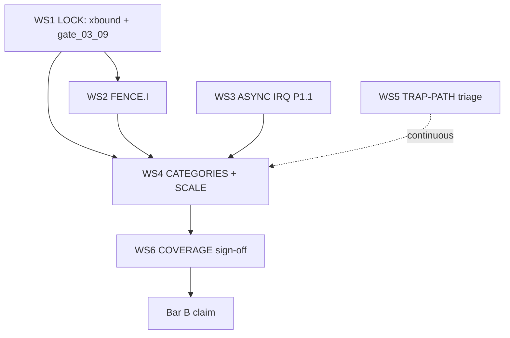

# Acceptance Spec + Phased Plan — Magpie_M1 “Passes RISC-V DV” (Bar B)

**Campaign:** RV32IMC_Zicsr_Zifencei, M-mode only  
**Authority:** Spike per-commit lockstep + pytest gates  
**Claim standard:** Honest, unqualified, defensible — no silent waivers, no scope shrink after green

---

## 1. ACCEPTANCE SPEC (minimum checklist)

### 1A. Scope honesty (gate-enforced, pre-scale)

| # | Requirement | Pass criterion |
|---|-------------|----------------|
| S1 | In-repo gen config documents **enabled** and **excluded** knobs with rationale | Only A/F/D/V, S/U, MMU/Sv32, PMP excluded; everything in RV32IMC_Zicsr_Zifencei enabled |
| S2 | `gate_03_09` (or successor) asserts config hash matches declared scope | PASS on campaign rev |
| S3 | FENCE.I enabled | `--no_fence=0` |
| S4 | Async interrupts enabled | `--enable_interrupt=1` (or equivalent) |
| S5 | Unaligned load/store enabled | `--enable_unaligned_load_store=1` |
| S6 | Full sync mix | load/store, branch/jump, CSR, RV32M, RV32C, sync traps — no narrowing flags |

### 1B. riscv-dv standard categories — MUST run vs N/A

| Category | Verdict | One-line rationale |
|----------|---------|-------------------|
| `riscv_arithmetic_instr_test` | **MUST** | RV32I + RV32M base |
| `riscv_rand_instr_test` | **MUST** | Primary full-mix generator |
| `riscv_loop_test` | **MUST** | Control-flow + hazard stress |
| `riscv_jump_stress_test` | **MUST** | Branch/jump + redirect/BP interaction |
| `riscv_csr_test` | **MUST** | Zicsr M-mode CSRs |
| `riscv_interrupt_test` | **MUST** (after WS3) | Async MTI/MSI/MEI — core gap for Bar B |
| `riscv_unaligned_load_store_test` | **MUST** | Explicit unaligned policy (mcause 4/6) |
| `riscv_illegal_instr_test` | **MUST** | Illegal insn trap path |
| `riscv_ecall_test` / `riscv_ebreak_test` | **MUST** | Sync trap contract |
| `riscv_mmu_stress_test` | **N/A** | No S/U-mode, no Sv32 |
| `riscv_amo_test` | **N/A** | No A extension |
| `riscv_floating_point_*` | **N/A** | No F/D |
| `riscv_pmp_*` | **N/A** | Explicitly out of ISA scope |
| `riscv_vector_*` | **N/A** | No V extension |
| `riscv_hypervisor_*` | **N/A** | No H extension |

**Directed supplements (not riscv-dv categories, but mandatory):**

- xbound regression matrix: single/double/TRIPLE cross-boundary + stall/redirect × cross-boundary (WS1 lock)
- FENCE.I directed: `fence.i` + fetch of same/cache-adjacent line (SMC corner)
- IRQ directed: MTI/MSI/MEI at retire boundaries listed in §3

### 1C. Per-category scale + zero-divergence bar

| Tier | Categories | Commits matched (Spike) | Seeds | Divergence |
|------|------------|-------------------------|-------|------------|
| **Campaign aggregate** | All MUST categories combined | **≥ 100,000** | ≥ 100 | **0** unresolved real |
| **Per MUST category** | Each row in 1B MUST | **≥ 10,000** each | ≥ 20 | **0** per category |
| **IRQ category** | `riscv_interrupt_test` + IRQ directed | **≥ 20,000** | ≥ 30 | **0**; every injection event has `trap_event` match |
| **Corner directed** | xbound, FENCE.I, trap-path minimals | N/A (directed) | full matrix green | **0** |

**“Matched commit” definition:** Per-commit architectural retire agrees with Spike on `pc`, `insn` (or trap substitute), `rd`/`mem` effects, and `trap_event` when applicable. Unresolved = any mismatch not classified handler-artifact per §4.

### 1D. Functional coverage bar

| # | Requirement |
|---|-------------|
| C1 | Coverage model enumerates **every enabled ISA class** from S1–S6 (I/M/C/CSR/trap/unaligned/FENCE.I/IRQ) |
| C2 | **100%** functional goal per enabled class, or explicit waiver with directed justification test — **no cold-zone hand-wave** |
| C3 | Line/toggle coverage: 100% or line-level waiver tied to unreachable M-mode-only paths with proof |
| C4 | Coverage run uses **same** gen config hash as lockstep campaign |
| C5 | Gemini coverage-gap map reviewed; Claude accepts or closes each gap before claim |

### 1E. Provenance (per shard + campaign rollup)

Each `dv_farm` shard and final rollup MUST record:

```
git_rev, rtl_cksum, spike_version, riscv-dv_rev, verilator_version,
gen_config_path + config_hash, seed_list, category, 
commits_matched, commits_total, divergence_count,
compare_policy_version, trap_event_schema_version,
host, timestamp, farm_worker_id
```

Campaign closeout artifact: `campaign_B_pass.json` + pytest gate referencing it. **Producer ≠ approver:** farm runs may be automated; Claude alone signs acceptance.

### 1F. One-page acceptance sign-off (Claude)

- [ ] S1–S6 scope honest  
- [ ] All MUST categories at tier scale, 0 divergence  
- [ ] IRQ determinism spec (§3) satisfied with trap_event audit  
- [ ] xbound + stall×cross matrix green  
- [ ] FENCE.I enabled + lockstep green  
- [ ] Coverage C1–C5 closed  
- [ ] Provenance complete  
- [ ] No open “real DUT” trap-path bugs (§4)

---

## 2. PHASE ORDER (WS1–WS6)



| Phase | Work | Depends on | Parallel with | Gates |
|-------|------|------------|---------------|-------|
| **P0** | WS1 LOCK | — | WS2 RTL-readiness review (Codex, read-only) | P1+ |
| **P1** | WS2 FENCE.I | WS1 xbound directed green | WS3 spec/interface design | Full-mix with fence |
| **P2** | WS3 ASYNC IRQ | Retire/trap_event interface landed | WS2 sim farm (different seeds) | `riscv_interrupt_test` |
| **P2.5** | WS5 TRAP-PATH | Full-mix running | WS2/WS3 | Scale (WS4) if unresolved real bugs |
| **P3** | WS4 CATEGORIES+SCALE | P0–P2 green | WS6 enumeration (Gemini) | Coverage sign-off |
| **P4** | WS6 COVERAGE | WS4 aggregate ≥100k | — | Bar B claim |

### Where xbound + stall×cross-boundary lead slots

**P0, before any scope expansion** — not parallelized with FENCE.I or IRQ scale:

1. Run directed matrix: single/double/TRIPLE consecutive cross-boundary (post ADR-0007 fix).
2. Add **stall×redirect × cross-boundary** cases (Gemini Layer-1 lead: stale `cur_half_lo` after redirect) — minimal repro first, then rand stress.
3. Re-run `gate_03_09` + synctrap subset (≥5k commits) to confirm J18 full-mix PASS is real, not cached-log artifact.

**Decision gate:** If stall×cross reproduces divergence → **stop P1/P2 scale**, fix RTL (Claude), Codex review landed diff only. If directed green but rand hits xbound-like failure → treat as WS5 trap-path, not waive.

**Parallel lanes (hub-and-spoke):**

- Claude: WS1 fix/commit, WS3 TB interface, gate ownership  
- Codex: RTL-readiness at post-landed sync points only  
- Grok: §3 IRQ spec, §4 triage policy (this doc)  
- Gemini: stall×cross repro, coverage maps, log condensation — never blocks farm

---

## 3. ASYNC-IRQ DETERMINISM SPEC (P1.1 tightened)

### Architectural ground truth (RISC-V Privileged Spec)

- Interrupts are **precise**: taken at an instruction boundary, never mid-instruction (Priv §3.1.6 / interrupt delivery).
- Pending bits in `mip` are visible to both hart and external agent; enable in `mie`; global enable `mstatus.MIE` (M-mode).
- On taken interrupt: `mcause` has MSB=1; `mepc` = address of interrupted instruction (or PC of instruction following faulting instruction for traps — **use interrupt rule**: interrupted instruction PC); `mstatus.MPIE` ← `MIE`; `MIE` ← 0; `MPP` ← current mode.

### EXACT invariant (retire-count injection)

Define **retire_count** = number of architecturally retired instructions since reset (same counter on DUT TB and Spike golden).

**Injection rule IR-1:**  
At the moment DUT and Spike both observe `retire_count == K` **after** instruction `I_K` has fully retired (writeback + CSR side effects visible, no younger insn committed), and **before** `I_{K+1}` executes any architecturally visible effect:

1. Testbench writes the same `mip` bit(s) on **both** DUT (CLINT model) and Spike (`write_csr` or equivalent) in the same simulation quantum **after** retire `K`, **before** fetch/decode of `K+1`.
2. Both models run identical M-mode interrupt recognition logic on the **next** instruction boundary.

**Invariant IR-2 (equality of decision point):**  
The interrupt is taken iff, at boundary after retire `K`:

```
(mip & mie & MIE_eff) != 0
```

where `MIE_eff` follows Priv spec (M-mode uses `mstatus.MIE`). DUT and Spike must evaluate this on the **same** boundary.

**Invariant IR-3 (no time-travel):**  
Injection never occurs between micro-op phases of a single retired insn. Multi-cycle MUL/DIV/DIV: interrupt **cannot** be taken until the M insn retires as one instruction (Unpriv §2.4 — interrupts between instructions).

### `trap_event` fields — MUST match

| Field | Match rule |
|-------|------------|
| `retire_count_at_trap` | Equal (or `K+1` boundary consistently defined — pick one, document) |
| `mepc` | Equal |
| `mcause` | Equal (including interrupt MSB + code: 3=MSI, 7=MTI, 11=MEI for standard CLINT mapping) |
| `mtval` | Equal (0 for these interrupts) |
| `mstatus.MIE/MPIE/MPP` | Equal post-trap-entry |
| `mip` (pre-recognition) | Equal at injection boundary |
| `pc_redirect` | Equal (handler entry PC) |
| `interrupt_source` | MSI/MTI/MEI enum equal |

Optional debug: `interrupted_insn_pc`, `next_insn_pc` — must be consistent with `mepc` choice.

### Failure modes to guard

| Mode | Spec basis | Guard |
|------|------------|-------|
| IRQ during MUL/DIV busy | Precise interrupts | Inject only on retire boundaries; compare policy ignores mid-busy cycles |
| IRQ during cross-boundary fetch/decode | Precise interrupts | If insn not yet retired, injection waits; illegal vs IRQ priority: **synchronous trap on faulting insn before async** (Priv §3.1.6 priority) |
| IRQ during existing handler (nesting) | `MIE`=0 in handler | Async **masked** unless test explicitly re-enables `MIE`; nested async only in tests that set `MIE=1` in handler — document separately |
| MSI/MTI/MEI ordering | Platform-defined priority | CLINT priority table fixed in TB; same on Spike |
| WFI | Not in RV32IMC scope unless implemented | If unimplemented: `illegal`; do not generate in riscv-dv until defined — **N/A unless ADR adds WFI** |
| Injection vs retire off-by-one | — | Directed tests at K ∈ {0, 1, after branch, after CSR, after M-retire} |
| Spike TB vs DUT TB mip write timing | — | Single `post_retire_callback(K)` hook shared by compare harness |

**Directed IRQ matrix (minimum):** inject at K = after ALU, after load-use stall, after branch taken, after `mret`, after `ecall` (should not nest if MIE=0), after M-div retire, after 16-bit insn retire, after cross-boundary 32-bit retire.

---

## 4. TRAP-PATH TRIAGE — handler-artifact vs real DUT bug

### Classification procedure (decisive, ordered)

**Step 1 — Boundary check**  
First divergence at commit index `N`: extract DUT vs Spike **architectural** state at last **agreed** retire `N-1`. If pre-trap state already differs → **real DUT bug** (execution), not trap-path.

**Step 2 — First trap entry compare**  
If divergence appears at first trap:

- Compare `mepc`, `mcause`, `mtval`, `mstatus` at trap entry.  
- **Any mismatch with identical pre-trap architectural state → real DUT trap bug.**

**Step 3 — Nested-trap / second-event divergence**  
If first trap **matched** and divergence appears on second trap or in handler:

- Check compare policy: is harness comparing **handler execution** as normal commits when Spike test program expects **emulation** or different handler layout?  
- Check `mret` restoration: `MPIE` → `MIE`, `MEPC` resume PC.  
- If DUT and Spike agree on all `trap_event` records but differ on a **non-trap** commit inside handler → **handler-artifact** (test program / linker / tohost / compare mask), per nested-trap reasoning: *the nested event is often a product of handler design and compare granularity, not fetch/decode/trap RTL.*

**Step 4 — Minimal repro**  
Shrink to ≤20 insn directed test. Still diverges at trap entry → DUT. Only diverges with full handler binary → artifact until proven otherwise.

**Step 5 — Spike-only sanity**  
Run same ELF on Spike standalone; if architectural trace matches DUT trap_events but lockstep fails → harness bug.

### Decision rule (harden vs waive vs fix)

| Classification | Action |
|----------------|--------|
| **Real DUT trap bug** | Fix RTL (Claude). No campaign credit until 0 divergence repro green. |
| **Handler-artifact** | Fix compare policy / handler contract / trap_event alignment. **Do not** waive divergence; **do not** patch RTL to “match a broken compare.” |
| **Spec ambiguity** | ADR + directed test; hold scale until resolved. |
| **Temptation to narrow gen** | **Forbidden** — counts as green-wash; fails S1–S2. |

**Nested-trap heuristic (reuse):** If `mcause`/`mepc` at event 1 match and event 2 is `ecall`/custom inside handler while compare expected no second trap → classify **handler-artifact** until DUT violates Priv §3.1.6 on interrupt priority with a **minimal** non-handler repro.

---

## 5. RISK REGISTER (top 5)

| # | Risk | Mitigation |
|---|------|------------|
| R1 | **Green-wash / scope narrowing** (`--no_fence`, `--enable_interrupt=0`, drop CSR) to regain green | `gate_03_09` + config hash in provenance; Bar B requires explicit S3/S4; PL rejects any campaign pass without them |
| R2 | **Interrupt non-determinism** (off-by-one retire, mip write timing, MEI/MTI race) | §3 IR-1/IR-2; shared `post_retire_callback`; trap_event audit; ≥20k IRQ commits before scale |
| R3 | **FENCE.I + SMC corner** (modified insn fetch ordering) | Directed `fence.i` tests; enable `--no_fence=0` only after decode/flush contract verified; Codex RTL-readiness on IFU fence semantics |
| R4 | **Residual xbound / stall×redirect** (stale `cur_half_lo`) | WS1 P0 gate; directed TRIPLE + redirect matrix before FENCE.I/IRQ scale; treat rand xbound failures as P0 not WS5 |
| R5 | **Trap-path time sink** (handler-artifact flagged as DUT) | §4 procedure mandatory; Gemini condensation → Grok classification → Claude fix compare before RTL churn; cap RTL trap fixes without minimal repro |

---

## Recommended immediate dispatch (next 48h)

1. **Claude:** WS1 P0 — stall×cross directed + `gate_03_09` re-verify.  
2. **Codex (read-only):** IFU `fence.i` flush semantics + retire/trap_event port readiness for WS3.  
3. **Gemini:** stall×cross repro + coverage class map vs enabled ISA.  
4. **Grok (here):** IRQ TB hook review when Claude drafts `post_retire_callback` — audit against IR-1..IR-3.

**Bar B is not claimed until §1F is fully checked** — synctrap_100k is necessary baseline, not sufficient.
