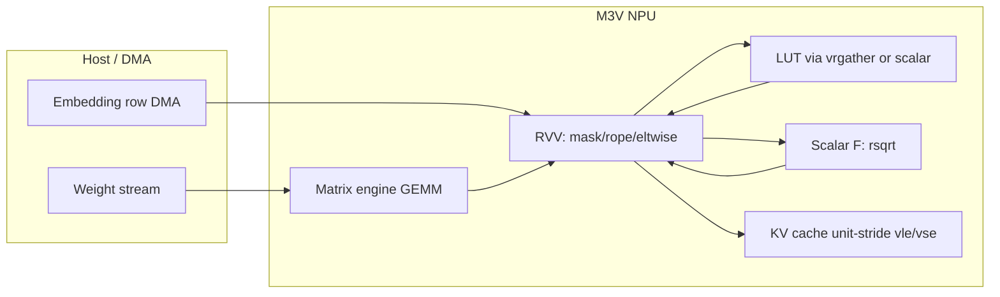

# Gemma 3 on M3V Zve32x — Gap Analysis (Architect View)

**Bottom line up front:** Gemma-3 int8/int4 inference is **functionally expressible** on your current stack (RVV integer + scalar F + matrix engine + DMA). Nothing in the Gemma-3 op graph is **architecturally blocked**. The real pain is **throughput and memory hierarchy**, not missing opcodes. The shortest list of additions that change *feasibility* is essentially **empty**; the shortest list that changes *practical edge latency* is **2–3 ISA conveniences + systems sizing**.

---

## 1. Gemma-3 Op → Your Primitives

| Gemma-3 component | Primary primitives | Coverage |
|---|---|---|
| **Token embedding** | Host/DMA row copy → `vle` along hidden dim | ✅ Full (systems-limited) |
| **Q/K/V/O projections** | Matrix engine int8 GEMM + requant | ✅ Full |
| **GQA head repeat** | `vmv` / splat / unrolled `vrgather` (m1) / scalar broadcast | ✅ Full (awkward) |
| **RoPE on Q,K** | `vmul`, `vadd`, `vsub`, half-swap via `vslide`/`vrgather`; sin/cos **precomputed table** broadcast per position | ✅ Full |
| **QKᵀ scores** | Matrix engine or RVV dot along head_dim | ✅ Full |
| **Scale (√d)** | `vsmul` or scalar | ✅ Full |
| **Causal + sliding-window mask** | `vmseq`/`vmslt` + mask logicals + `vmerge` | ✅ Full |
| **Softmax** | `vredmax` → `vsub` → exp(LUT/poly) → `vredsum` → reciprocal | ✅ Full (kernel-heavy) |
| **Attn @ V** | GEMM / weighted sum | ✅ Full |
| **KV cache write** | Scalar/`vse` append at `seq` offset | ✅ Full |
| **KV cache read (decode)** | Loop positions; `vle` each K row (contiguous head_dim) | ✅ Full with layout discipline |
| **RMSNorm** | `vmul` square → mean reduce → **scalar F `rsqrt`** → `vsmul` weight | ✅ Full |
| **MLP gate/up/down** | GEMMs | ✅ Full |
| **GeGLU / GELU** | `vmul` gate × GELU(up); GELU via LUT/poly/scalar | ✅ Full (slow path ok) |
| **int4 weights** | unpack nibble: `vand`/`vsrl`/`vor` + matrix path | ✅ Full |
| **Residual adds** | `vadd` | ✅ Full |
| **Local↔global layer alternation** | Static mask table per layer type | ✅ Full (no new ISA) |

**Fully covered without workaround:** int8 GEMMs, elementwise arithmetic/logic, compares/masks, mask-scan, reductions (unmasked), permutation within m1, segment unit-stride memory.

**Covered via kernel strategy (not ISA):** masked softmax, RMSNorm reduce, transcendental activations, embedding gather, RoPE tables.

---

## 2. Deep Dive on Your Six Focus Areas

### (a) Transcendentals — GELU / exp / tanh / softmax exp

**How int8 LLMs actually do it (including Coral-class edge NPUs):**

1. Run softmax/GELU in **wider fixed-point** (int16/int32 acc space) inside the layer — not pure int8 end-to-end inside the nonlinearity.
2. **LUT** indexed by quantized value (often 256–1024 entries), sometimes **piecewise linear** or **low-order polynomial** on a subrange.
3. **Scalar fallback** per lane is universal on small Zve32x cores when vector gather width is tight.

**Does LUT require `vluxei`?** **No.**

| Approach | Needs `vluxei`? | Your path |
|---|---|---|
| Scalar table lookup per element | No | Extract → `lw` table[index] → write back. Slow, always works. |
| **`vrgather` from register-held LUT** | No | `vle` LUT chunk into `v8`; indices = clamped activations; `vrgather.vv`. **This is the Coral-parity vector LUT pattern.** |
| Memory-indexed `vluxei` | Yes | Faster when LUT stays in DRAM and indices are vectorized — convenience, not correctness. |

**GELU/GeGLU:** same story — `gate ⊙ LUT(up)` with `vmul`. Functional on RVV today; int4 weights don't change the activation story.

**Honest limit:** `vrgather` **m1-only** ⇒ 4×i32 or 16×i8 lanes per uop. Softmax row length = window or context ⇒ **stripmine loop**. That's efficiency, not blockage.

---

### (b) Softmax over causal-masked scores

**Does it need masked reductions?** **No for correctness.**

Standard workaround (Coral uses the same integer trick):

```
scores' = vmerge(mask, scores, -INF)   // or large negative sentinel
m = vredmax(scores')                    // unmasked reduce
exp_scores = LUT(scores' - m)
s = vredsum(exp_scores)
out = vmul(exp_scores, 1/s)
```

For **sum**, merge masked-out lanes to **0** before `vredsum`.

Your deferred **masked reductions** (`vm=0` on `vredmax`/`vredsum`) are a **throughput / code-size** gap, not functional. `vmerge-then-unmasked-reduce` is the canonical substitute.

---

### (c) RMSNorm `rsqrt`

**Scalar F is sufficient.** One scalar `rsqrt(mean_sq + ε)` per norm group (per token × sublayer). Hidden dim reduce is vector (`vredsum` in chunks); only the nonlinear is scalar.

Vector `rsqrt` would need Zve32f or a vector LUT — **not required** for Gemma-3 parity; Coral Kelvin is also Zve32x integer + scalar F for this class of op.

---

### (d) KV-cache access — need `vlse`?

**Unit-stride is OK** with the standard layout:

```
K/V cache: [layer][kv_head][seq_pos][head_dim]   // head_dim contiguous
```

- **Decode:** for each cached position `t`, `vle` `head_dim` bytes from `base + t * stride_row` where `stride_row = head_dim` (or padded alignment). Outer scalar loop over `t`.
- **Append:** `vse` at `base + seq * stride_row`.

**`vlse` helps when** layout is `[head_dim][seq]` (stride-1 along time) — common in *training* frameworks, rare as a **hard requirement** in edge inference firmware. You choose layout; DMA can transpose offline.

**Sliding-window layers:** only last `W` positions matter ⇒ smaller working set, still unit-stride per row.

**Gap type:** kernel/layout choice, not ISA blockage.

---

### (e) Embedding gather

**Host/DMA one contiguous row is enough.**

- `embedding[token_id]` is a contiguous `hidden_size` vector in the weight table.
- Firmware: compute row address → DMA (or AXI read burst) into DTCM/scratch → `vle` consume.
- Prefill with `T` tokens: `T` DMAs or batched if indices known (prompt is sequential chunk).

**`vluxei` / vector indexed gather** matters for **batch prefill throughput** on random token indices, not for autoregressive decode (one token at a time).

Large vocab (Gemma 3 ≈ 256K): table lives in **external memory** — you already weight-stream via DMA. **DTCM 32KB** cannot hold the table; that's **systems**, not RVV gap.

---

### (f) RoPE sin/cos — precomputed table?

**Yes — standard and fully adequate.**

Per position `p` (and per freq bucket `i`):
- Precompute `sin/cos` table `[max_seq][rot_dim/2]` or freq-based compact table.
- Load scalars for position `p`, **splat** (`vmv.v.x`) across vector lanes.
- `rotate_half` via `vslide` / `vrgather` within head_dim stripmines.

No transcendental at runtime; no indexed memory load required if you broadcast per-position constants once per token.

---

## 3. Gap Ranking by ROI (Gemma-3 Specific)

| Rank | Item | Class | Blocks Gemma? | ROI rationale |
|---|---|---|---|---|
| — | **None** | — | No | Full graph expressible today |
| 1 | **TCM size / weight+KV DRAM bandwidth** | Systems | No (slow) | 270M/1B weights + KV dominate wall-clock; bigger than any single RVV opcode |
| 2 | **`vluxei` / `vsuxei`** | ISA (deferred) | No | Speeds LUT softmax/GELU and wide embedding prefill; Coral may same-limit but firmware often fakes with scalar/`vrgather` |
| 3 | **Masked `vredmax`/`vredsum`** | ISA (deferred) | No | Cleaner softmax/RMSNorm; saves `vmerge` + sentinel tuning |
| 4 | **`vrgather` > m1 / `vrgatherei16`** | ISA (deferred) | No | Wider LUT uops per instruction (16×i8 lanes you have; still stripmined for 128–2K softmax rows) |
| 5 | **`vlse`** | ISA (deferred) | No | Only if refusing layout discipline; low ROI if firmware owns tensor layout |
| 6 | **Vector FP (Zve32f)** | ISA (out of scope) | No | Scalar F covers rsqrt; vector FP is anti-Coral-parity |
| 7 | **Matrix engine shape coverage** | Systems/kernel | No | Very wide MLP/attn proj benefit from K-chunked GEMM you already have; skinny ops may be RVV-bound |

**True Zve32x ISA gaps for Gemma-3:** `vluxei`, masked reductions, `vlse`, wider gather — **all performance/convenience**, not functional.

**Coral parity (not a gap):** integer softmax via LUT + scalar; scalar `rsqrt`; DMA embedding row; unit-stride KV; m1 stripmining.

---

## 4. Bottom Line

### Functionally expressible today?

**Yes.** With:
- Matrix engine for projections and large matmuls
- RVV for elementwise, masks, RoPE, residual, int4 unpack
- Scalar RV32-F for `rsqrt` (and any stray scalar transcendental reference)
- `vmerge` + unmasked reductions for softmax/RMSNorm
- Register/`vrgather` or scalar LUT for exp/GELU
- DMA row embedding + contiguous KV layout
- Weight/KV streaming from external memory (ITCM/DTCM are control/scratch, not model store)

You can run Gemma-3 270M/1B int8/int4 **correctly** — slowly, memory-bandwidth-bound, like any small edge NPU running a 1B LLM.

### Shortest addition list

**If "functional" means correct tokens out:**
> **Zero ISA additions required.**

**If "practical edge latency" means acceptable prefill/decode:**
1. **`vluxei`** (or commit to optimized `vrgather`-LUT firmware and accept stripmine)
2. **Masked reductions** (`vredmax`/`vredsum` with `vm=0`)
3. **Systems:** KV cache policy + weight streaming (not RVV); optionally **`vlse`** only if layout can't be frozen

**Do not add** Zve32f for Gemma-3 — breaks Coral parity story and doesn't unlock anything scalar F can't do at RMSNorm scale.

---

## Architecture Diagram (Dataflow, No New ISA)



---

## Honest Distinction Summary

| Concern | Verdict |
|---|---|
| **Functionally blocked** | Nothing identified in Gemma-3 op set |
| **Slow / inefficient** | Softmax/GELU LUT stripmining, scalar fallback paths, m1 `vrgather`, no masked reduce |
| **Systems-bound** | 1B model in 32KB DTCM impossible; decode memory-bound; ITCM pressure for firmware |
| **Coral same limit** | Integer-only vector, scalar transcendental helpers, LUT softmax — **parity, not gap** |

**Recommendation for roadmap:** Ship Gemma-3 as a **firmware/kernel exercise** on current ISA; promote **`vluxei` + masked reductions** only if measured prefill/softmax dominates after contiguous KV + `vrgather`-LUT optimization. Do not block B3/B4 Zve32x completion on LLM features you can already emulate — unless product marketing requires "LLM-optimized" ISA bullets with benchmark proof.
